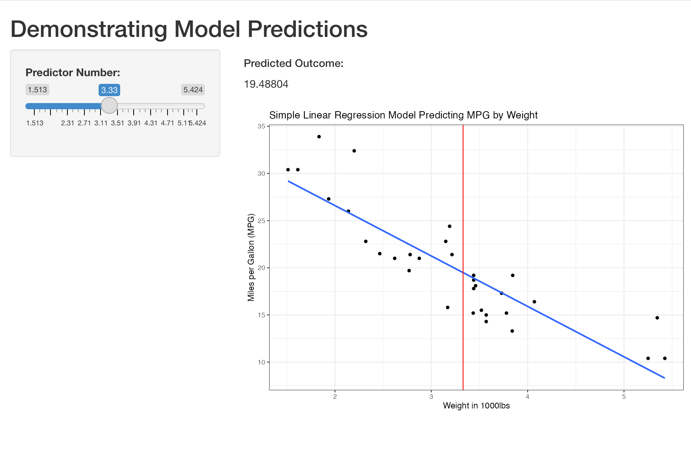

```{r setup, include=FALSE}
knitr::opts_chunk$set(echo = FALSE)
```

## Background

- This linear model was created for the Coursera course, Developing Data Products, produced by Johns Hopkins University  
- The course project is to create a shiny app and a sales pitch slide deck for the app  
- This is the sales pitch, and I will show you how YOU can visualize a prediction model

## Methodology

- I used the mtcars dataset, which comes standard in R
- Using Miles Per Gallon (MPG) as the outcome, I found the two most correlated factors (weight and cylinders)
- Since there are only 3 cylinders, and weight is a continuous variable, I chose to use weight as a predictor

```{r cars, echo = FALSE, message=FALSE, warning=FALSE}
library(ggcorrplot)
data(mtcars)

correlation_matrix <- round(cor(mtcars),1)
corrp.mat <- cor_pmat(mtcars)
ggcorrplot(correlation_matrix, hc.order =TRUE, 
           type ="lower", lab =TRUE)
```

## Example Model

The model takes a slider input for the weight,and returns the MPG prediction using weight as the predictor. The app also provides a visual for the model fit, as well as your input predictor value laid over the chart.

{#id .class width=60% height=60%}

## Play with the Model!

[Head over to Shinyapps.io to try it out!](https://rhowell421.shinyapps.io/Model_Selector)

[Or, Check out the GitHub and Fork to play](https://github.com/rhowell421/Developing_Data_Products/tree/gh-pages)
